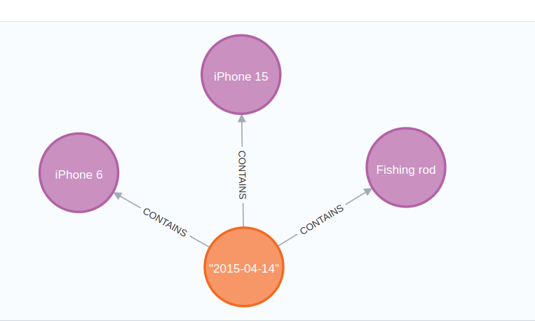
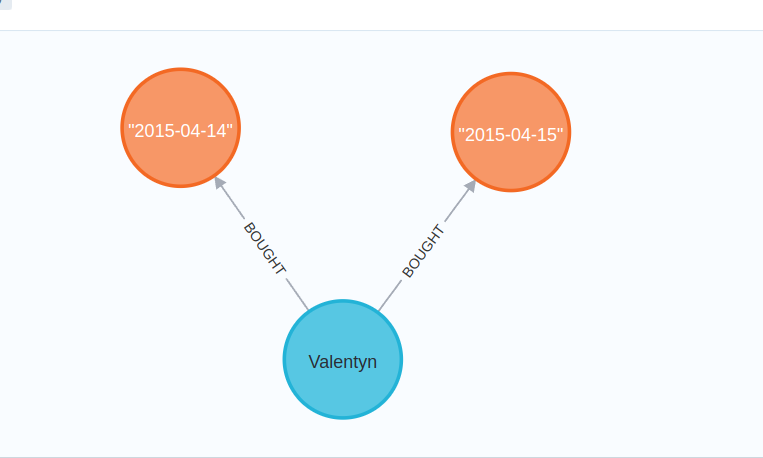
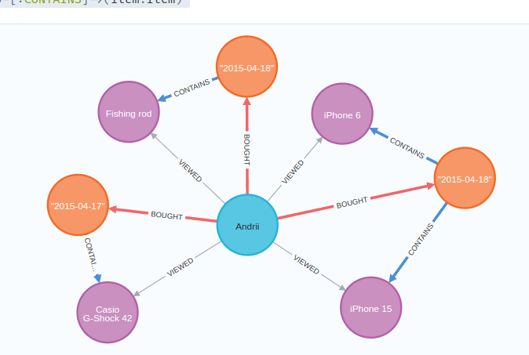
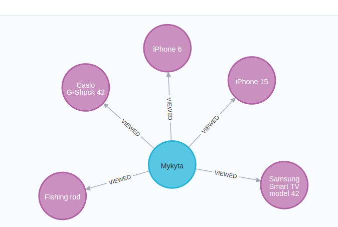
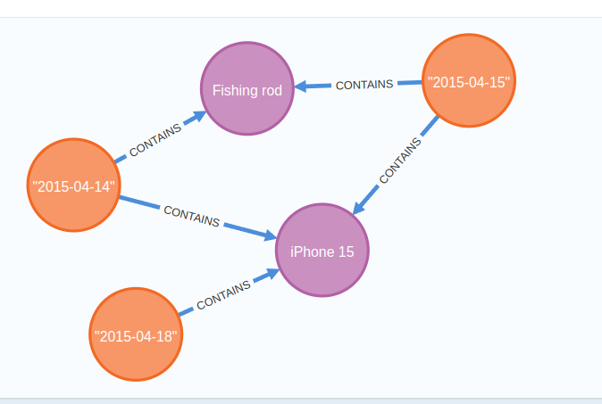
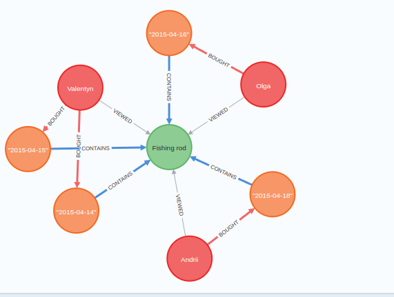
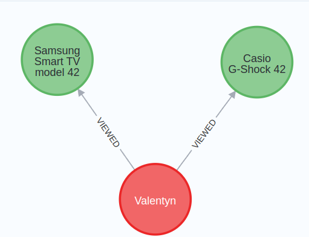

# neo4j basics

1. Find all items in an order by order ID
```cypher
MATCH (order:Order {id: 1001})-[:CONTAINS]->(item:Item)
RETURN order,item;
```



2. Calculate the total price of a specific Order
```cypher
MATCH (order:Order {id: 1001})-[:CONTAINS]->(item:Item)
RETURN order.id AS orderID, sum(item.price) AS totalOrderPrice;
```
```text
╒═══════╤═══════════════╕
│orderID│totalOrderPrice│
╞═══════╪═══════════════╡
│1001   │1966           │
└───────┴───────────────┘
```

3. Find all Orders of a specific Customer
```cypher
MATCH (customer:Customer {id: 101})-[:BOUGHT]->(order:Order)
RETURN customer, order;
```


4. Find all Items bought by a specific Customer
```cypher
MATCH (customer:Customer {id: 103})-[:BOUGHT]->(order:Order)-[:CONTAINS]->(item:Item)
RETURN customer, order, item;
```


5. Find for the Customer the total amount of items he purchased (through his orders)
```cypher
MATCH (customer:Customer {id: 103})-[:BOUGHT]->(order:Order)-[:CONTAINS]->(item:Item)
RETURN customer.name, COUNT(item) AS itemCount;
```

```text
╒═════════════╤═════════╕
│customer.name│itemCount│
╞═════════════╪═════════╡
│"Andrii"     │4        │
└─────────────┴─────────┘
```

6. Find how many times each item was purchased and sort by purchase count.
```cypher
MATCH (order:Order)-[:CONTAINS]->(item:Item)
RETURN item.name, COUNT(order) AS purchaseCount
  ORDER BY purchaseCount DESC;
```

```text
╒═══════════════════════════╤═════════════╕
│item.name                  │purchaseCount│
╞═══════════════════════════╪═════════════╡
│"Fishing rod"              │4            │
├───────────────────────────┼─────────────┤
│"iPhone 6"                 │3            │
├───────────────────────────┼─────────────┤
│"iPhone 15"                │3            │
├───────────────────────────┼─────────────┤
│"Samsung Smart TV model 42"│1            │
├───────────────────────────┼─────────────┤
│"Casio G-Shock 42"         │1            │
└───────────────────────────┴─────────────┘
```

7. Find all Items viewed by a specific Customer
```cypher
MATCH (customer:Customer {id: 104})-[:VIEWED]->(item:Item)
RETURN customer, item;
```


8. Find other Items that were purchased together with a specific Item (that is, all Items included in the Order-s together with the Item data)
```cypher
MATCH (targetItem:Item {id: 1})<-[:CONTAINS]-(order:Order)-[:CONTAINS]->(relatedItem:Item)
  WHERE targetItem <> relatedItem
RETURN order, relatedItem;
```


9. Find all Customers who bought a specific Item
```cypher
MATCH (customer:Customer)-[:BOUGHT]->(order:Order)-[:CONTAINS]->(item:Item {id: 3})
RETURN customer, order, item;
```


10. Find items for a specific Customer that he viewed but did not buy.
```cypher
MATCH (customer:Customer {id: 101})-[:VIEWED]->(viewedItem:Item)
  WHERE NOT (customer)-[:BOUGHT]->(:Order)-[:CONTAINS]->(viewedItem)
RETURN customer, viewedItem;
```
